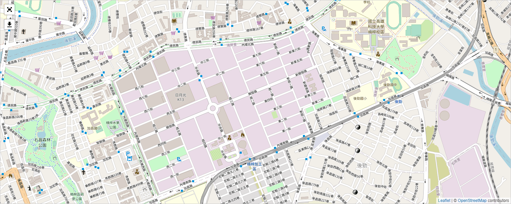
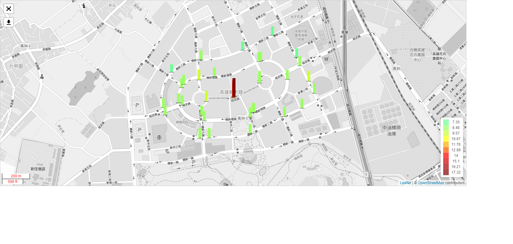
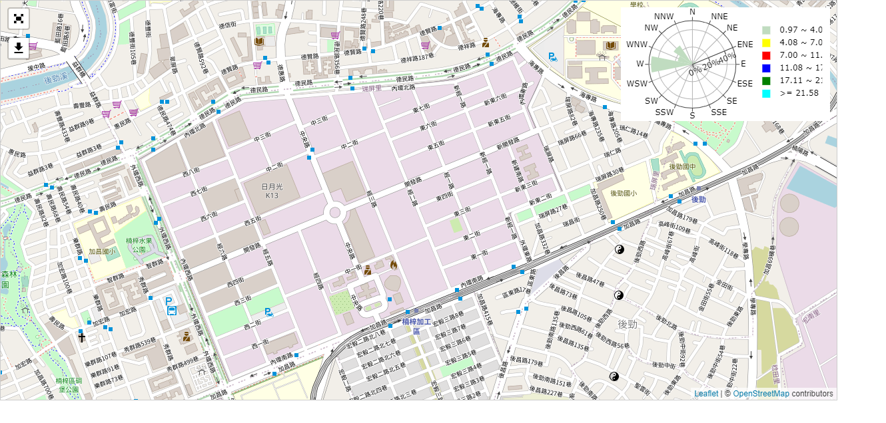

# EV_Project
 Visualize air pollution with wind rose, contour map bar chart on a map using Python.

## Description
This project aims to visualize air pollution data using various chart. It includes the generation of wind rose diagram, contour map, and bar chart, all plotted on a map. 

This project utilizes Flask as a server, which is a lightweight web framework. Additionally, it uses SQLite as a database to store sensor data. Users can select the desired time range of data to generate different charts through the web interface.

The key features of this project include:
* Wind rose diagrams: Displaying the distribution of wind direction and speed.
* Contour map & bar chart: Showing comparisons of air pollution levels at different locations.
* GIF maker: Users can generate GIFs on the website to visualize changes in pollution levels over time.
* Visualize settings: Users can adjust the color scale of chart.


## Installation
```
pip install -r requirements.txt
```

## Usage
```
python app.py
```

Then you can see the web on http://127.0.0.1:8000/

`To test the function, you can use the data inside the 'Test data' directory.`

### 

### Wind rose:
`You can use the 'wind_rose_test.xlsx' file to conduct the test. Remember to specify the desired time range. Ex: 2021-06-03 09:00 ~ 2021-06-03 10:00`

### Bar chart & COntour map
`You can use the 'PM25.csv' file to conduct the test. Please remember to specify the desired number of divisions. Ex: 10`

## Note:
[Notion Note](https://battle-windshield-ec3.notion.site/0f1fe2a66e7f4f8eb811767dd8caa850)

## Demo
### 等濃度圖 (contour map)


### 柱狀圖 (Bar chart)


### 風玫圖 (Wind rose)

 

